# 📱 Guía de Endpoints para Clientes - Burritos To Go

**Fecha:** 2025-10-26  
**Versión API:** 1.0

---

## 🎯 Funcionalidades del Cliente

El cliente puede realizar las siguientes acciones:

1. ✅ **Consultar menú** - Ver productos disponibles organizados por categoría
2. ✅ **Hacer pedidos** - Crear nuevos pedidos con validación de saldo
3. ✅ **Consultar pedidos** - Ver pedidos actuales y pasados
4. ✅ **Consultar saldo** - Ver saldo actual de la cuenta
5. ✅ **Recargar saldo** - Agregar fondos a la cuenta

---

## 📋 Tabla de Endpoints

| Funcionalidad | Método | Endpoint | Autenticación |
|--------------|--------|----------|---------------|
| Consultar menú | GET | `/api/cliente/menu/` | No |
| Ver mis pedidos | GET | `/api/cliente/mis-pedidos/` | Sí |
| Ver mi saldo | GET | `/api/cliente/mi-saldo/` | Sí |
| Recargar saldo | POST | `/api/cliente/recargar-saldo/` | Sí |
| Crear pedido | POST | `/api/crear_pedido/` | Sí |

---

## 🔐 Autenticación

Para endpoints que requieren autenticación, incluir el header:

```
Authorization: Token tu_token_aqui
```

---

## 📖 Detalle de Endpoints

### 1. Consultar Menú

**Endpoint:** `GET /api/cliente/menu/`

**Descripción:** Obtiene el menú completo con categorías y productos activos.

**Autenticación:** No requerida

**Ejemplo de Request:**
```bash
curl -X GET http://localhost:8000/api/cliente/menu/
```

**Ejemplo de Response:**
```json
{
  "categorias": [
    {
      "id": 1,
      "nombre": "Burritos",
      "productos": [
        {
          "id": 1,
          "nombre": "Burrito de Carne Asada",
          "descripcion": "Delicioso burrito con carne asada, frijoles, queso y salsa",
          "precio": "80.00",
          "categoria_nombre": "Burritos"
        },
        {
          "id": 2,
          "nombre": "Burrito de Pollo",
          "descripcion": "Burrito de pollo con guacamole",
          "precio": "75.00",
          "categoria_nombre": "Burritos"
        }
      ]
    },
    {
      "id": 2,
      "nombre": "Bebidas",
      "productos": [
        {
          "id": 5,
          "nombre": "Refresco 500ml",
          "descripcion": "Refresco de cola",
          "precio": "20.00",
          "categoria_nombre": "Bebidas"
        }
      ]
    }
  ],
  "total_categorias": 2
}
```

---

### 2. Consultar Mis Pedidos

**Endpoint:** `GET /api/cliente/mis-pedidos/`

**Descripción:** Consulta los pedidos del cliente autenticado.

**Autenticación:** Requerida

**Parámetros de Query (opcionales):**
- `tipo` - Filtrar por tipo de pedido:
  - `actuales` - Pedidos pendiente o en_proceso
  - `pasados` - Pedidos completado o cancelado
- `estatus` - Filtrar por estatus específico: `pendiente`, `en_proceso`, `completado`, `cancelado`

**Ejemplos de Request:**

```bash
# Todos mis pedidos
curl -X GET http://localhost:8000/api/cliente/mis-pedidos/ \
  -H "Authorization: Token abc123xyz"

# Solo pedidos actuales
curl -X GET "http://localhost:8000/api/cliente/mis-pedidos/?tipo=actuales" \
  -H "Authorization: Token abc123xyz"

# Solo pedidos pasados
curl -X GET "http://localhost:8000/api/cliente/mis-pedidos/?tipo=pasados" \
  -H "Authorization: Token abc123xyz"

# Solo pedidos pendientes
curl -X GET "http://localhost:8000/api/cliente/mis-pedidos/?estatus=pendiente" \
  -H "Authorization: Token abc123xyz"
```

**Ejemplo de Response:**
```json
{
  "pedidos": [
    {
      "id": 12,
      "cliente": 3,
      "cliente_nombre": "juan_cliente",
      "productos_detalle": [
        {
          "id": 1,
          "nombre": "Burrito de Carne Asada",
          "precio": 80.00
        },
        {
          "id": 5,
          "nombre": "Refresco 500ml",
          "precio": 20.00
        }
      ],
      "total": "100.00",
      "estatus": "pendiente",
      "fecha": "2025-10-26T18:30:00Z"
    },
    {
      "id": 10,
      "cliente": 3,
      "cliente_nombre": "juan_cliente",
      "productos_detalle": [
        {
          "id": 2,
          "nombre": "Burrito de Pollo",
          "precio": 75.00
        }
      ],
      "total": "75.00",
      "estatus": "completado",
      "fecha": "2025-10-25T12:00:00Z"
    }
  ],
  "total": 2,
  "filtros_aplicados": {
    "tipo": null,
    "estatus": null
  }
}
```

---

### 3. Consultar Mi Saldo

**Endpoint:** `GET /api/cliente/mi-saldo/`

**Descripción:** Consulta el saldo actual del cliente.

**Autenticación:** Requerida

**Ejemplo de Request:**
```bash
curl -X GET http://localhost:8000/api/cliente/mi-saldo/ \
  -H "Authorization: Token abc123xyz"
```

**Ejemplo de Response:**
```json
{
  "saldo": 500.00,
  "usuario": "juan_cliente",
  "email": "juan@example.com",
  "fecha_consulta": "2025-10-26T18:35:00Z"
}
```

---

### 4. Recargar Saldo

**Endpoint:** `POST /api/cliente/recargar-saldo/`

**Descripción:** Recarga saldo a la cuenta del cliente.

**Autenticación:** Requerida

**Body (JSON):**
```json
{
  "monto": 100.00
}
```

**Validaciones:**
- Monto debe ser positivo (mínimo $0.01)
- Monto máximo: $10,000.00
- Debe ser un número decimal válido

**Ejemplo de Request:**
```bash
curl -X POST http://localhost:8000/api/cliente/recargar-saldo/ \
  -H "Authorization: Token abc123xyz" \
  -H "Content-Type: application/json" \
  -d '{"monto": 100.00}'
```

**Ejemplo de Response (Éxito):**
```json
{
  "mensaje": "Saldo recargado exitosamente",
  "monto_recargado": 100.00,
  "saldo_anterior": 500.00,
  "saldo_actual": 600.00,
  "usuario": "juan_cliente",
  "fecha_recarga": "2025-10-26T18:40:00Z"
}
```

**Ejemplo de Response (Error):**
```json
{
  "error": "Datos inválidos",
  "detalles": {
    "monto": ["El monto debe ser mayor a 0"]
  }
}
```

---

### 5. Crear Pedido

**Endpoint:** `POST /api/crear_pedido/`

**Descripción:** Crea un nuevo pedido con validación de saldo.

**Autenticación:** Requerida

**Body (JSON):**
```json
{
  "productos": [1, 5]
}
```
*Array de IDs de productos*

**Validaciones:**
- Productos deben existir y estar activos
- Cliente debe tener saldo suficiente
- Se descuenta el total del saldo automáticamente

**Ejemplo de Request:**
```bash
curl -X POST http://localhost:8000/api/crear_pedido/ \
  -H "Authorization: Token abc123xyz" \
  -H "Content-Type: application/json" \
  -d '{"productos": [1, 5]}'
```

**Ejemplo de Response (Éxito):**
```json
{
  "mensaje": "Pedido creado exitosamente.",
  "pedido_id": 13,
  "total": 100.0,
  "productos": [
    "Burrito de Carne Asada",
    "Refresco 500ml"
  ],
  "fecha": "2025-10-26T18:45:00Z",
  "saldo_restante": 500.0
}
```

**Ejemplo de Response (Saldo Insuficiente):**
```json
{
  "error": "Saldo insuficiente.",
  "saldo_actual": 50.0,
  "total_pedido": 100.0,
  "faltante": 50.0
}
```

**Ejemplo de Response (Productos Inválidos):**
```json
{
  "error": "No se encontraron productos válidos."
}
```

---

## 🔄 Flujo Típico de Usuario Cliente

### Escenario: Cliente hace un pedido

```mermaid
sequenceDiagram
    participant C as Cliente
    participant API as API Burritos
    participant DB as Base de Datos

    C->>API: GET /api/cliente/menu/
    API->>DB: Obtener categorías y productos activos
    DB-->>API: Categorías con productos
    API-->>C: Menú completo

    C->>API: GET /api/cliente/mi-saldo/
    API->>DB: Obtener saldo del cliente
    DB-->>API: Saldo: $500
    API-->>C: Saldo actual

    C->>API: POST /api/crear_pedido/ {productos: [1,5]}
    API->>DB: Validar productos
    DB-->>API: Productos válidos
    API->>API: Calcular total: $100
    API->>API: Validar saldo: $500 >= $100 ✅
    API->>DB: Crear pedido
    API->>DB: Descontar saldo: $500 - $100 = $400
    DB-->>API: Pedido creado
    API-->>C: Pedido #13 creado, Saldo: $400

    C->>API: GET /api/cliente/mis-pedidos/?tipo=actuales
    API->>DB: Obtener pedidos actuales del cliente
    DB-->>API: Pedidos pendientes/en_proceso
    API-->>C: Lista de pedidos actuales
```



---

## 📝 Códigos de Estado HTTP

| Código | Descripción | Cuándo se usa |
|--------|-------------|---------------|
| 200 | OK | Request exitoso (GET, POST) |
| 201 | Created | Recurso creado exitosamente |
| 400 | Bad Request | Datos inválidos o falta información |
| 401 | Unauthorized | No autenticado (falta token) |
| 403 | Forbidden | Autenticado pero sin permisos |
| 404 | Not Found | Recurso no encontrado |
| 500 | Server Error | Error interno del servidor |

---

## ⚠️ Errores Comunes y Soluciones

### Error: "Authentication credentials were not provided"
**Causa:** No se envió el token de autenticación  
**Solución:** Agregar header `Authorization: Token tu_token`

### Error: "Saldo insuficiente"
**Causa:** El total del pedido excede el saldo del cliente  
**Solución:** Recargar saldo primero con `/api/cliente/recargar-saldo/`

### Error: "No se encontraron productos válidos"
**Causa:** Los IDs de productos no existen o están inactivos  
**Solución:** Consultar menú actualizado con `/api/cliente/menu/`

### Error: "El monto debe ser mayor a 0"
**Causa:** Intentar recargar con monto negativo o cero  
**Solución:** Enviar monto positivo (mínimo $0.01)

---

## 🧪 Casos de Prueba

### Caso 1: Consultar menú sin autenticación
```bash
curl -X GET http://localhost:8000/api/cliente/menu/
# ✅ Debe funcionar sin token
```

### Caso 2: Crear pedido con saldo suficiente
```bash
# 1. Verificar saldo
curl -X GET http://localhost:8000/api/cliente/mi-saldo/ \
  -H "Authorization: Token abc123"
# Respuesta: saldo = 500

# 2. Crear pedido de $100
curl -X POST http://localhost:8000/api/crear_pedido/ \
  -H "Authorization: Token abc123" \
  -H "Content-Type: application/json" \
  -d '{"productos": [1, 5]}'
# ✅ Pedido creado, nuevo saldo = 400
```

### Caso 3: Intentar crear pedido con saldo insuficiente
```bash
# Saldo actual: $50
curl -X POST http://localhost:8000/api/crear_pedido/ \
  -H "Authorization: Token abc123" \
  -H "Content-Type: application/json" \
  -d '{"productos": [1, 5]}'
# ❌ Error: Saldo insuficiente
```

### Caso 4: Recargar saldo
```bash
curl -X POST http://localhost:8000/api/cliente/recargar-saldo/ \
  -H "Authorization: Token abc123" \
  -H "Content-Type: application/json" \
  -d '{"monto": 200.00}'
# ✅ Saldo recargado: $50 + $200 = $250
```

### Caso 5: Filtrar pedidos actuales
```bash
curl -X GET "http://localhost:8000/api/cliente/mis-pedidos/?tipo=actuales" \
  -H "Authorization: Token abc123"
# ✅ Solo pedidos pendiente o en_proceso
```

---

## 📞 Soporte

Para dudas sobre el uso de la API:
- Consultar `rules.md` - Documentación técnica completa
- Consultar `SOLUCION_FINAL.md` - Detalles de implementación

---

**Versión:** 1.0  
**Última actualización:** 2025-10-26  
**Estado:** ✅ Funcional y Probado
