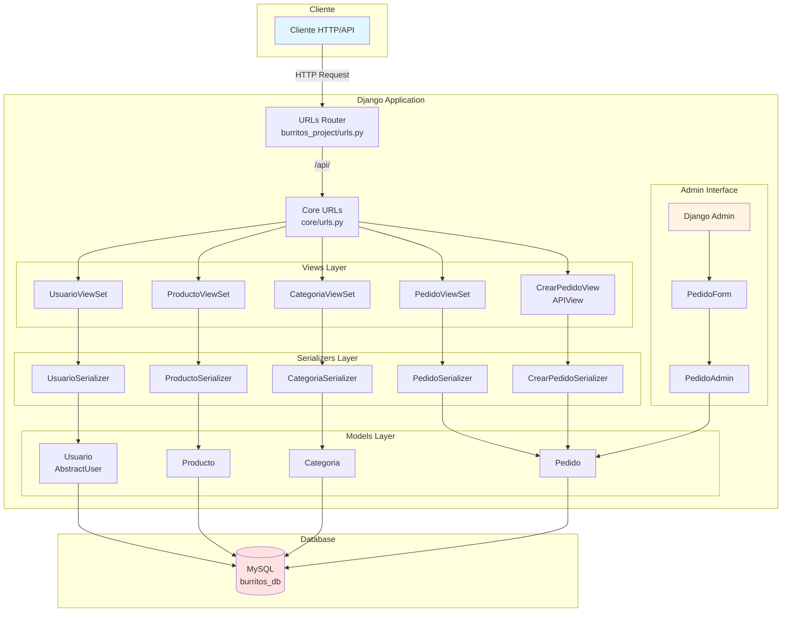
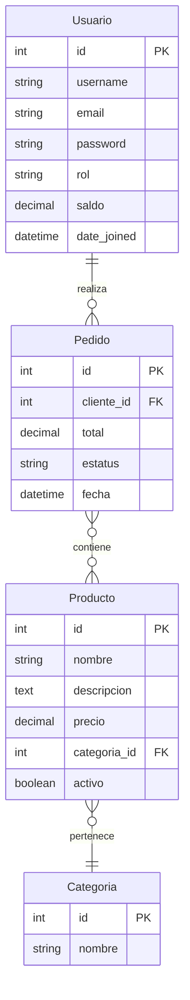

# 🌯 Burritos To Go - Reglas de Desarrollo y Arquitectura

## 📋 Tabla de Contenidos
1. [Información General del Proyecto](#información-general-del-proyecto)
2. [Arquitectura del Proyecto](#arquitectura-del-proyecto)
3. [Diagrama de Arquitectura](#diagrama-de-arquitectura)
4. [Modelos de Datos](#modelos-de-datos)
5. [Reglas de Programación](#reglas-de-programación)
6. [Estructura de Directorios](#estructura-de-directorios)
7. [Convenciones de Código](#convenciones-de-código)
8. [Buenas Prácticas](#buenas-prácticas)

---

## 📌 Información General del Proyecto

**Nombre:** Burritos To Go  
**Framework:** Django 5.2.7  
**API:** Django REST Framework  
**Base de Datos:** MySQL (burritos_db)  
**Tipo:** API REST para sistema de pedidos de comida

### Propósito
Sistema de gestión de pedidos de burritos que permite:
- Gestión de usuarios con roles (Super Usuario, Administrador, Cliente)
- Catálogo de productos y categorías
- Sistema de pedidos con validación de saldo
- Administración personalizada de pedidos

---

## 🏗️ Arquitectura del Proyecto

### Patrón Arquitectónico
**MTV (Model-Template-View)** de Django con REST API

### Componentes Principales

1. **Models (Modelos)** - `core/models.py`
   - Definen la estructura de datos
   - Lógica de negocio básica
   - Relaciones entre entidades

2. **Views (Vistas)** - `core/views.py`
   - ViewSets de Django REST Framework
   - APIView personalizada para pedidos
   - Lógica de control y validaciones

3. **Serializers (Serializadores)** - `core/serializers.py`
   - Conversión de modelos a JSON
   - Validación de datos de entrada
   - Definición de campos expuestos en API

4. **URLs (Rutas)** - `core/urls.py` y `burritos_project/urls.py`
   - Enrutamiento de endpoints
   - Configuración de routers REST

5. **Admin (Administración)** - `core/admin.py`
   - Interfaz administrativa personalizada
   - Validaciones personalizadas en formularios
   - Gestión de relaciones ManyToMany

---

## 📊 Diagrama de Arquitectura



---

## 📦 Modelos de Datos



### Descripción de Modelos

#### 1. **Usuario** (Extiende AbstractUser)
- **Rol:** Define permisos (super, admin, cliente)
- **Saldo:** Billetera virtual del usuario
- **Relaciones:** Un usuario puede tener muchos pedidos
- **Custom User Model:** Configurado en `settings.AUTH_USER_MODEL = 'core.Usuario'`

#### 2. **Categoria**
- Clasificación de productos
- Relación: Una categoría tiene muchos productos

#### 3. **Producto**
- **Campo activo:** Soft delete para no eliminar productos
- **Precio:** DecimalField para precisión monetaria
- **Relación:** Pertenece a una categoría

#### 4. **Pedido**
- **ManyToMany con Productos:** Un pedido puede tener múltiples productos
- **Total:** Se calcula automáticamente en el método `save()`
- **Estatus:** Control del estado del pedido
- **Validación:** Se verifica saldo suficiente antes de crear

---

## ⚙️ Reglas de Programación

### 1. **Modelos (Models)**

#### ✅ HACER:
- Usar `DecimalField` para valores monetarios (precio, saldo, total)
  ```python
  precio = models.DecimalField(max_digits=10, decimal_places=2)
  ```
- Implementar `__str__()` en todos los modelos para representación legible
- Usar `auto_now_add=True` para timestamps de creación
- Implementar soft delete con campo `activo` en lugar de eliminar registros
- Validar lógica de negocio en el método `save()` cuando sea apropiado

#### ❌ NO HACER:
- No usar `FloatField` para dinero (impreciso)
- No eliminar físicamente registros que afecten historial
- No poner lógica de negocio compleja en modelos (usar services/views)

### 2. **Serializadores (Serializers)**

#### ✅ HACER:
- Especificar campos explícitamente cuando sea posible
  ```python
  fields = ['id', 'username', 'email', 'rol', 'saldo']
  ```
- Usar `read_only=True` para campos calculados o autogenerados
  ```python
  extra_kwargs = {
      'cliente': {'read_only': True},
      'total': {'read_only': True}
  }
  ```
- Implementar validaciones personalizadas en `validate_<field_name>()`
- Crear serializadores específicos para operaciones complejas (ej: CrearPedidoSerializer)

#### ❌ NO HACER:
- No exponer campos sensibles (passwords, tokens)
- No usar `fields = '__all__'` en producción sin revisar qué campos se exponen
- No incluir lógica de negocio en serializadores (solo validación de formato)

### 3. **Vistas (Views)**

#### ✅ HACER:
- Usar `ViewSet` para operaciones CRUD estándar
- Usar `APIView` para lógica personalizada compleja
- Filtrar querysets según contexto:
  ```python
  queryset = Producto.objects.filter(activo=True)
  ```
- Validar permisos con `permission_classes`
- Manejar errores con Response y status codes apropiados:
  ```python
  return Response({'error': 'mensaje'}, status=400)
  ```
- Usar `perform_create()` para lógica adicional en creación
- Calcular totales antes de guardar
- Validar saldo suficiente antes de procesar pedidos

#### ❌ NO HACER:
- No exponer endpoints sin validación de permisos
- No devolver errores genéricos sin contexto
- No modificar datos sin validación previa
- No confiar en datos del cliente sin sanitizar

### 4. **URLs**

#### ✅ HACER:
- Usar `DefaultRouter` para ViewSets
- Prefijos descriptivos (`api/`, versiones futuras: `api/v1/`)
- Nombres descriptivos para rutas personalizadas:
  ```python
  path('crear_pedido/', CrearPedidoView.as_view(), name='crear_pedido')
  ```
- Separar URLs por app (`core/urls.py`)

#### ❌ NO HACER:
- No mezclar URLs de diferentes apps en un solo archivo
- No usar rutas ambiguas o confusas

### 5. **Administración (Admin)**

#### ✅ HACER:
- Personalizar formularios para validaciones complejas
- Usar `filter_horizontal` para relaciones ManyToMany
- Implementar validaciones en `clean()` del formulario
- Mostrar mensajes de éxito/error al usuario:
  ```python
  messages.success(request, "✅ Operación exitosa")
  ```
- Excluir campos autocalculados del formulario:
  ```python
  exclude = ('total',)
  ```
- Pasar `request` al formulario cuando se necesite contexto

#### ❌ NO HACER:
- No permitir edición de campos calculados
- No ignorar validaciones de negocio en admin
- No exponer operaciones peligrosas sin confirmación

### 6. **Configuración (Settings)**

#### ✅ HACER:
- Mantener `SECRET_KEY` segura (usar variables de entorno en producción)
- Configurar `DEBUG = False` en producción
- Especificar `ALLOWED_HOSTS` en producción
- Registrar apps propias en `INSTALLED_APPS`
- Configurar correctamente la base de datos
- Definir `AUTH_USER_MODEL` si se usa modelo personalizado

#### ❌ NO HACER:
- No commitear `SECRET_KEY` en repositorios públicos
- No dejar `DEBUG = True` en producción
- No usar contraseñas vacías en producción

---

## 📁 Estructura de Directorios

```
burritos_to_go/
│
├── burritos_project/          # Configuración principal del proyecto
│   ├── __init__.py
│   ├── settings.py           # ⚙️ Configuración global
│   ├── urls.py               # 🔗 URLs principales
│   ├── asgi.py               # ASGI para deployment
│   └── wsgi.py               # WSGI para deployment
│
├── core/                      # App principal
│   ├── migrations/           # Migraciones de base de datos
│   ├── __init__.py
│   ├── admin.py              # 🛠️ Configuración admin personalizada
│   ├── apps.py               # Configuración de la app
│   ├── models.py             # 📊 Modelos de datos
│   ├── serializers.py        # 🔄 Serializadores REST
│   ├── views.py              # 👁️ Vistas y lógica de negocio
│   ├── urls.py               # 🔗 URLs de la app
│   └── tests.py              # 🧪 Tests (pendiente implementar)
│
├── venv/                      # Entorno virtual (no versionar)
├── env/                       # Entorno virtual alternativo
├── manage.py                  # 🎮 CLI de Django
└── rules.md                   # 📖 Este archivo
```

---

## 💻 Convenciones de Código

### Nomenclatura

#### Archivos y Módulos
- `snake_case` para archivos Python: `models.py`, `serializers.py`
- Nombres descriptivos: `crear_pedido_view.py`

#### Clases
- `PascalCase` para clases:
  ```python
  class UsuarioViewSet(viewsets.ModelViewSet):
  class CrearPedidoSerializer(serializers.Serializer):
  ```

#### Variables y Funciones
- `snake_case` para variables y funciones:
  ```python
  total_pedido = sum(precios)
  def calcular_total():
  ```

#### Constantes
- `UPPER_SNAKE_CASE` para constantes:
  ```python
  ROLES = (
      ('super', 'Súper Usuario'),
      ('admin', 'Administrador'),
  )
  ```

### Comentarios

#### En Español
- Comentarios informativos en español
- Emojis opcionales para mejor legibilidad:
  ```python
  # ✅ Validar saldo del cliente
  # 👈 Esta línea debe estar
  ```

#### Docstrings
- Usar docstrings para funciones y clases complejas:
  ```python
  """
  Crea un pedido validando saldo del cliente.
  
  Args:
      request: Request con productos_ids
      
  Returns:
      Response con detalles del pedido o error
  """
  ```

#### 🆕 Comentarios Descriptivos para Correcciones de Bugs

**NUEVA REGLA**: Cuando se corrige un bug o se modifica lógica crítica de negocio, agregar comentarios estructurados que documenten:

1. **PROBLEMA DETECTADO**: Descripción clara del bug
2. **CÓDIGO ANTERIOR**: Snippet del código problemático
3. **PROBLEMA**: Lista numerada de los issues específicos
4. **SOLUCIÓN IMPLEMENTADA**: Lista numerada de los cambios
5. **JUSTIFICACIÓN**: Por qué esta solución es correcta

##### ✅ FORMATO ESTÁNDAR:

```python
def metodo_corregido(self):
    """
    PROBLEMA DETECTADO: [Descripción breve del bug]
    
    CÓDIGO ANTERIOR:
        [código antiguo que causaba el problema]
    
    PROBLEMA: 
        1. [Issue específico #1]
        2. [Issue específico #2]
        3. [Issue específico #3]
    
    SOLUCIÓN IMPLEMENTADA:
        1. [Cambio realizado #1]
        2. [Cambio realizado #2]
        3. [Cambio realizado #3]
    
    JUSTIFICACIÓN:
        - [Razón por la que esta solución es correcta]
        - [Cómo previene el problema original]
        - [Qué reglas de negocio cumple]
    """
    # ✅ Código corregido con comentarios inline
    variable = valor  # Explicación de esta línea específica
```

##### 📋 EJEMPLO REAL (Bug de Saldo en Pedidos):

```python
def perform_create(self, serializer):
    """
    PROBLEMA DETECTADO: No se descontaba el saldo del cliente al crear pedido
    
    CÓDIGO ANTERIOR:
        serializer.save(cliente=self.request.user)
        productos = serializer.validated_data.get('productos', [])
        total = sum([p.precio for p in productos])
        serializer.save(cliente=self.request.user, total=total)
    
    PROBLEMA: 
        1. Se guardaba dos veces el pedido (doble save())
        2. NO se validaba saldo suficiente del cliente
        3. NO se descontaba el total del saldo del cliente
        4. Inconsistencia con otras vistas que SÍ descuentan
    
    SOLUCIÓN IMPLEMENTADA:
        1. Calcular total ANTES de guardar
        2. Validar saldo suficiente del cliente
        3. Guardar pedido UNA SOLA VEZ con todos los datos
        4. Descontar total del saldo del cliente
        5. Persistir cambios con cliente.save()
    
    JUSTIFICACIÓN:
        - Cumple regla de negocio: todo pedido debe descontar saldo
        - Previene saldos negativos con validación previa
        - Mantiene consistencia entre diferentes endpoints
        - Evita race conditions del double-save
    """
    # Calcular total del pedido
    productos = serializer.validated_data.get('productos', [])
    total = sum([p.precio for p in productos])
    cliente = self.request.user
    
    # ✅ Validar saldo suficiente ANTES de crear
    if cliente.saldo < total:
        raise ValidationError({'error': 'Saldo insuficiente'})
    
    # ✅ Guardar pedido UNA SOLA VEZ
    pedido = serializer.save(cliente=cliente, total=total)
    
    # ✅ Descontar saldo del cliente
    cliente.saldo -= total
    cliente.save()
```

##### 🎯 CUÁNDO USAR ESTE FORMATO:

- ✅ Corrección de bugs de lógica de negocio
- ✅ Modificación de validaciones críticas
- ✅ Cambios que afectan datos financieros (saldos, pagos, totales)
- ✅ Correcciones de race conditions o double-saves
- ✅ Fixes de inconsistencias entre diferentes partes del código

##### ❌ CUÁNDO NO ES NECESARIO:

- Cambios cosméticos o de formato
- Renombramiento de variables simple
- Agregado de logging
- Refactorización sin cambio de comportamiento

### Imports

#### Orden
1. Librerías estándar de Python
2. Django y terceros
3. Módulos locales

```python
from django.contrib.auth.models import AbstractUser  # Django
from django.db import models
from rest_framework import serializers              # Terceros
from .models import Usuario, Producto               # Local
```

---

## ✨ Buenas Prácticas

### 1. **Seguridad**

- ✅ Validar permisos en todas las vistas sensibles
- ✅ Sanitizar entrada de usuarios
- ✅ No exponer información sensible en respuestas de error
- ✅ Usar HTTPS en producción
- ✅ Implementar rate limiting para APIs públicas

### 2. **Base de Datos**

- ✅ Crear migraciones después de cambios en modelos:
  ```bash
  python manage.py makemigrations
  python manage.py migrate
  ```
- ✅ Usar `select_related()` y `prefetch_related()` para optimizar queries
- ✅ Indexar campos de búsqueda frecuente
- ✅ Usar transacciones para operaciones críticas:
  ```python
  from django.db import transaction
  
  with transaction.atomic():
      # operaciones que deben ser atómicas
  ```

### 3. **API REST**

- ✅ Usar verbos HTTP correctamente:
  - GET: Lectura
  - POST: Creación
  - PUT/PATCH: Actualización
  - DELETE: Eliminación
- ✅ Retornar códigos de estado apropiados:
  - 200: OK
  - 201: Created
  - 400: Bad Request
  - 401: Unauthorized
  - 403: Forbidden
  - 404: Not Found
  - 500: Server Error
- ✅ Proveer mensajes de error descriptivos
- ✅ Documentar endpoints (considerar Swagger/OpenAPI)

### 4. **Testing**

- ✅ Escribir tests para:
  - Modelos (validaciones, métodos personalizados)
  - Vistas (endpoints, permisos)
  - Serializadores (validaciones)
- ✅ Usar fixtures para datos de prueba
- ✅ Ejecutar tests antes de commits:
  ```bash
  python manage.py test
  ```

### 5. **Versionamiento**

- ✅ Usar Git para control de versiones
- ✅ Commits descriptivos en español:
  ```
  feat: agregar validación de saldo en pedidos
  fix: corregir cálculo de total en pedidos
  refactor: optimizar query de productos activos
  ```
- ✅ No versionar:
  - `venv/`, `env/`
  - `__pycache__/`
  - `*.pyc`
  - `.env` (variables de entorno)
  - `db.sqlite3`

### 6. **Desempeño**

- ✅ Paginar resultados grandes
- ✅ Usar caché para datos frecuentes
- ✅ Optimizar queries N+1
- ✅ Comprimir respuestas grandes
- ✅ Usar índices en base de datos

### 7. **Mantenibilidad**

- ✅ Código DRY (Don't Repeat Yourself)
- ✅ Funciones pequeñas y enfocadas
- ✅ Separar lógica de negocio de presentación
- ✅ Documentar decisiones arquitectónicas
- ✅ Mantener dependencias actualizadas

---

## 🔄 Flujo de Trabajo de Desarrollo

### 1. Crear Nueva Funcionalidad

```bash
# 1. Crear/modificar modelo
# Editar core/models.py

# 2. Crear migración
python manage.py makemigrations

# 3. Aplicar migración
python manage.py migrate

# 4. Crear/actualizar serializer
# Editar core/serializers.py

# 5. Crear/actualizar vista
# Editar core/views.py

# 6. Configurar URL
# Editar core/urls.py

# 7. Probar en admin (opcional)
# Editar core/admin.py

# 8. Ejecutar servidor de desarrollo
python manage.py runserver
```

### 2. Proceso de Testing

```bash
# Crear tests en core/tests.py
python manage.py test core

# Tests específicos
python manage.py test core.tests.TestUsuario
```

### 3. Deployment

```bash
# 1. Actualizar settings para producción
# DEBUG = False
# ALLOWED_HOSTS = ['tu-dominio.com']

# 2. Colectar archivos estáticos
python manage.py collectstatic

# 3. Migrar base de datos de producción
python manage.py migrate --settings=burritos_project.settings_prod

# 4. Crear superusuario
python manage.py createsuperuser
```

---

## 📝 Endpoints Disponibles

### Usuarios
- `GET /api/usuarios/` - Listar usuarios
- `POST /api/usuarios/` - Crear usuario
- `GET /api/usuarios/{id}/` - Detalle usuario
- `PUT /api/usuarios/{id}/` - Actualizar usuario
- `DELETE /api/usuarios/{id}/` - Eliminar usuario

### Productos
- `GET /api/productos/` - Listar productos activos
- `POST /api/productos/` - Crear producto
- `GET /api/productos/{id}/` - Detalle producto
- `PUT /api/productos/{id}/` - Actualizar producto
- `DELETE /api/productos/{id}/` - Eliminar producto

### Categorías
- `GET /api/categorias/` - Listar categorías
- `POST /api/categorias/` - Crear categoría
- `GET /api/categorias/{id}/` - Detalle categoría
- `PUT /api/categorias/{id}/` - Actualizar categoría
- `DELETE /api/categorias/{id}/` - Eliminar categoría

### Pedidos
- `GET /api/pedidos/` - Listar pedidos
- `POST /api/pedidos/` - Crear pedido
- `GET /api/pedidos/{id}/` - Detalle pedido
- `PUT /api/pedidos/{id}/` - Actualizar pedido
- `DELETE /api/pedidos/{id}/` - Eliminar pedido
- `POST /api/crear_pedido/` - Crear pedido con validación de saldo

---

## 🎯 Mejoras Futuras Recomendadas

1. **Autenticación y Autorización**
   - Implementar JWT tokens
   - Sistema de permisos por rol
   - Endpoints de login/logout/registro

2. **Testing**
   - Suite completa de tests unitarios
   - Tests de integración
   - Coverage mínimo del 80%

3. **Documentación API**
   - Integrar Swagger/OpenAPI
   - Documentación interactiva

4. **Optimizaciones**
   - Sistema de caché (Redis)
   - Paginación en todos los listados
   - Compresión de respuestas

5. **Funcionalidades**
   - Sistema de notificaciones
   - Historial de pedidos
   - Calificaciones de productos
   - Cupones de descuento
   - Tracking de pedidos en tiempo real

6. **DevOps**
   - Dockerización
   - CI/CD pipeline
   - Monitoreo y logging
   - Backups automatizados

---

## 📞 Contacto y Soporte

Para dudas sobre este proyecto, consultar:
- Documentación oficial de Django: https://docs.djangoproject.com/
- Django REST Framework: https://www.django-rest-framework.org/
- Repositorio del proyecto: [Agregar URL]

---

**Última actualización:** 2025-10-24  
**Versión Django:** 5.2.7  
**Versión Python:** 3.x (recomendado 3.9+)

---

## 📄 Licencia

[Especificar licencia del proyecto]
